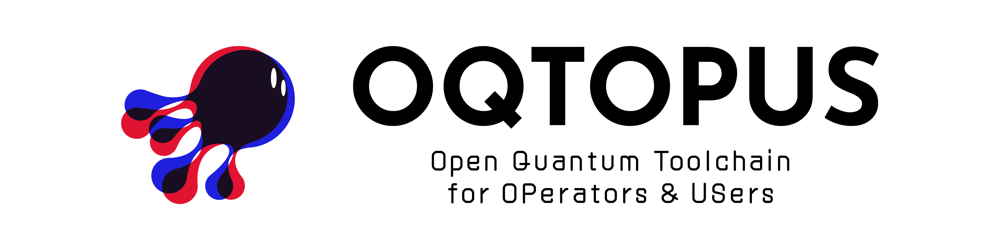

<!-- markdownlint-disable MD041 -->

# QDI OQTOPUS

## Overview

**QDI OQTOPUS** is an OQTOPUS implementation of the QDI (Quantum Device Interface).

## Usage

- [Getting Started](./usage/getting_started.md)

## API reference

- [API reference](./reference/API_reference.md)

## Developer Guidelines

- [Development Flow](./developer_guidelines/development_flow.md)
- [Setup Development Environment](./developer_guidelines/setup.md)
- [How to Contribute](./CONTRIBUTING.md)
- [Code of Conduct](https://github.com/oqtopus-team/.github/blob/main/CODE_OF_CONDUCT.md)
- [Security](https://github.com/oqtopus-team/.github/blob/main/SECURITY.md)

## Contact

You can contact us by creating an issue in this repository or by email:

- [oqtopus-team[at]googlegroups.com](mailto:oqtopus-team[at]googlegroups.com)

## License

QDI OQTOPUS is released under the [Apache License 2.0](https://github.com/oqtopus-team/pyqdi-oqtopus/blob/main/LICENSE).

## Supporting

Describe supporting organizations, grants, or contributors here.
